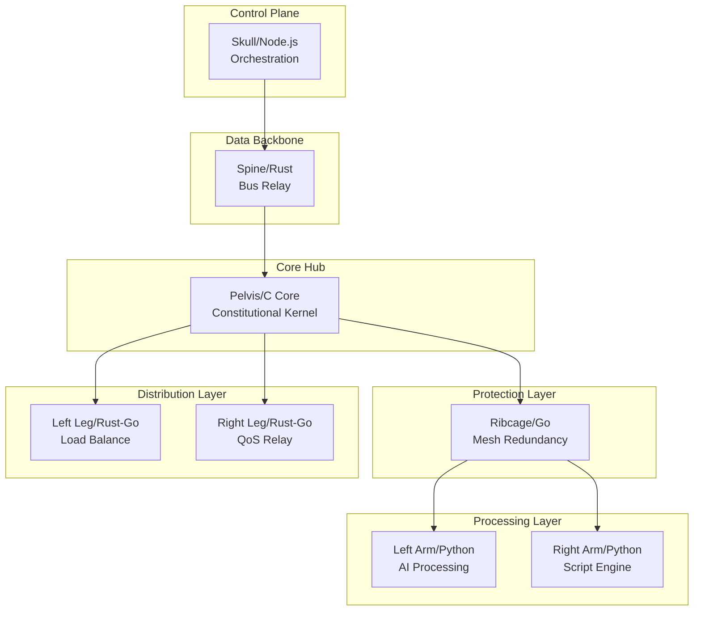

# OBINexus BlueShare Polyglot Exoskeleton Topology System (BPETS) Specification

**Document Path**: `obinexus/services/computing/blueshare-polyglot-exoskeleton/docs/bpets_spec.md`  
**Version**: 1.0.0+poly.pets  
**Author**: Integration Team with Nnamdi Michael Okpala  
**Status**: Technical Implementation Framework  
**Integration**: BlueShare Service, OBINexus Constitutional Framework, ExoSUIT Architecture  
**Classification**: Polyglot Infrastructure Service with Consciousness Preservation

---

## Executive Summary

The BlueShare Polyglot Exoskeleton Topology System (BPETS) represents a paradigmatic fusion of biological architecture, network topology, and polyglot runtime orchestration. By mapping human skeletal structures to distributed computing topologies and binding them through multi-language runtimes, BPETS enables resilient, adaptive infrastructure for civil collapse scenarios while maintaining constitutional compliance and consciousness preservation principles.

## Table of Contents

1. [Skeletal-Topological Architecture](#skeletal-topological-architecture)
2. [Polyglot Runtime Binding Framework](#polyglot-runtime-binding-framework)
3. [Network Topology Alignment](#network-topology-alignment)
4. [Constitutional Compliance Integration](#constitutional-compliance-integration)
5. [Deployment Architecture](#deployment-architecture)
6. [Testing and Validation Framework](#testing-and-validation-framework)
7. [Civil Collapse Operations Protocol](#civil-collapse-operations-protocol)
8. [Directory Structure](#directory-structure)

---

## Skeletal-Topological Architecture

### Core Mapping Philosophy

BPETS implements a biomimetic approach where each skeletal component maps to both a network topology role and a polyglot runtime binding:

```yaml
bpets_architecture:
  version: 1.0.0+poly.pets
  namespace: obinexus.blueshare.exoskeleton
  
  skeletal_mapping:
    # Control & Orchestration Layer
    skull:
      igbo_name: "ọkpụkpụ isi"
      topology_role: "star_root_controller"
      runtime: "node@18.x"
      function: "CLI orchestration, session management"
      
    # Data Relay Backbone
    spine:
      igbo_name: "ọkpụkpụ azụ"
      topology_role: "bus_backbone"
      runtime: "rust@1.82"
      function: "High-performance data relay, thread safety"
      
    # Protective Redundancy Layer
    ribcage:
      igbo_name: "ọkpụkpụ obi"
      topology_role: "mesh_protection"
      runtime: "go@1.23"
      function: "Concurrent monitoring, failover redundancy"
      
    # Distributed Processing Arms
    arms:
      igbo_name: "aka / ubu aka"
      topology_role: "star_leaf_processors"
      runtime: "python@3.12"
      function: "AI/ML adapters, scripting interfaces"
      
    # Edge Device Interface
    hands:
      igbo_name: "mkpịsị aka"
      topology_role: "edge_endpoints"
      runtime: "lua@5.4"
      function: "Lightweight embedded device control"
      
    # Core Switching Hub
    pelvis:
      igbo_name: "ọkpụkpụ afo"
      topology_role: "central_switch"
      runtime: "c-core"
      function: "Constitutional kernel, cost allocation"
      
    # Load-Bearing Relays
    legs:
      igbo_name: "ụkwụ"
      topology_role: "distributed_relays"
      runtime: "rust-go-hybrid"
      function: "Load balancing, QoS management"
      
    # Access Endpoints
    feet:
      igbo_name: "mkpịsị ụkwụ"
      topology_role: "mobile_access"
      runtime: "android-ios-sdks"
      function: "User device connectivity"
```

### Anatomical Network Principles



---

## Polyglot Runtime Binding Framework

### Language Selection Rationale

Each runtime is selected based on anatomical function mapping:

```typescript
interface PolyglotBinding {
  anatomy: string;
  runtime: Runtime;
  rationale: string;
  capabilities: string[];
}

const BPETS_BINDINGS: PolyglotBinding[] = [
  {
    anatomy: "skull",
    runtime: "node@18.x",
    rationale: "High-level control requires JavaScript's event-driven orchestration",
    capabilities: ["async_control", "cli_interface", "web_dashboard"]
  },
  {
    anatomy: "spine", 
    runtime: "rust@1.82",
    rationale: "Backbone requires memory safety and zero-cost abstractions",
    capabilities: ["thread_safety", "performance", "memory_control"]
  },
  {
    anatomy: "ribcage",
    runtime: "go@1.23", 
    rationale: "Protection layer needs concurrent goroutine monitoring",
    capabilities: ["concurrency", "network_monitoring", "failover"]
  },
  {
    anatomy: "arms",
    runtime: "python@3.12",
    rationale: "Manipulators need flexible scripting and ML libraries",
    capabilities: ["ai_ml_integration", "rapid_prototyping", "library_ecosystem"]
  },
  {
    anatomy: "hands",
    runtime: "lua@5.4",
    rationale: "Edge devices require minimal footprint embedding",
    capabilities: ["embedded_scripting", "low_memory", "fast_startup"]
  }
];
```

### Inter-Runtime Communication Protocol

```rust
// Rust spine implementation for polyglot message passing
pub struct BPETSMessage {
    source_anatomy: String,
    target_anatomy: String,
    payload: Vec<u8>,
    topology_route: NetworkTopology,
    constitutional_audit: HashMap<String, serde_json::Value>,
}

impl BPETSMessage {
    pub fn route_through_skeleton(&self) -> Result<DeliveryPath, BPETSError> {
        // Route based on anatomical topology
        match (&self.source_anatomy[..], &self.target_anatomy[..]) {
            ("skull", "arms") => self.route_star_topology(),
            ("spine", _) => self.route_bus_topology(),
            ("ribcage", _) => self.route_mesh_topology(),
            _ => self.route_hybrid_adaptive()
        }
    }
}
```

---

## Network Topology Alignment

### Biological-to-Network Mapping

```python
# Python arm implementation for topology management
from enum import Enum
from typing import Dict, List, Optional

class AnatomicalTopology(Enum):
    STAR = "skull_centralized"      # Brain controls periphery
    BUS = "spine_linear"            # Sequential vertebrae relay
    MESH = "ribcage_redundant"      # Protective cage mesh
    HYBRID = "legs_adaptive"        # Dynamic load distribution

class BPETSTopologyManager:
    def __init__(self):
        self.anatomy_map = {
            "skull": AnatomicalTopology.STAR,
            "spine": AnatomicalTopology.BUS,
            "ribcage": AnatomicalTopology.MESH,
            "legs": AnatomicalTopology.HYBRID
        }
        
    def calculate_optimal_route(
        self,
        source: str,
        destination: str,
        load_metrics: Dict[str, float]
    ) -> List[str]:
        """Calculate route based on skeletal biomechanics"""
        
        # Neural pathways (skull) use star topology
        if source == "skull":
            return self._star_route(destination)
            
        # Spinal cord uses sequential bus
        elif "spine" in source:
            return self._bus_route(destination)
            
        # Ribcage provides mesh redundancy
        elif source == "ribcage":
            return self._mesh_route(destination, redundancy=3)
            
        # Legs adapt based on load
        else:
            return self._hybrid_adaptive_route(destination, load_metrics)
```

### Topology Switching Logic

```go
// Go ribcage implementation for mesh protection
package bpets

type TopologySwitcher struct {
    currentTopology NetworkTopology
    skeletalState   map[string]AnatomicalHealth
    mutex           sync.RWMutex
}

func (ts *TopologySwitcher) AdaptTopology(stress StressMetrics) error {
    ts.mutex.Lock()
    defer ts.mutex.Unlock()
    
    // Ribcage expands under stress (mesh expansion)
    if stress.Level > CRITICAL_THRESHOLD {
        ts.expandMeshProtection()
    }
    
    // Spine stiffens under load (bus reinforcement)
    if stress.SpinalLoad > LOAD_THRESHOLD {
        ts.reinforceBusBackbone()
    }
    
    // Legs redistribute weight (hybrid adaptation)
    if stress.AsymmetricLoad {
        ts.rebalanceHybridLegs()
    }
    
    return nil
}
```

---

## Constitutional Compliance Integration

### BPETS Constitutional Framework

```yaml
constitutional_compliance:
  skeletal_rights:
    - right_to_structural_integrity
    - right_to_load_distribution
    - right_to_failover_protection
    - right_to_energy_efficiency
    
  polyglot_governance:
    transparency:
      - code_visibility: "all runtimes open source"
      - cost_allocation: "per-anatomy usage tracking"
      - audit_trail: "blockchain skeletal history"
      
    fairness:
      - load_balancing: "no single point of overload"
      - resource_sharing: "democratic energy distribution"
      - language_equality: "no runtime discrimination"
      
    accessibility:
      - neurodivergent_support: "multiple language paradigms"
      - disability_accommodation: "adaptive topology switching"
      - cultural_inclusion: "Igbo naming preservation"
```

### Consciousness Preservation in Polyglot Systems

```javascript
// Node.js skull implementation for consciousness monitoring
class BPETSConsciousnessMonitor {
  constructor() {
    this.skeletalCoherence = new Map();
    this.polyglotHarmony = new Map();
    this.constitutionalEngine = new ConstitutionalComplianceEngine();
  }
  
  async monitorSkeletalConsciousness() {
    // Ensure all anatomical components maintain coherence
    const anatomicalStates = await this.gatherAnatomicalStates();
    
    // Verify polyglot runtime harmony
    const runtimeHealth = await this.checkPolyglotHealth();
    
    // Constitutional compliance check
    const compliance = await this.constitutionalEngine.verify({
      skeletal_integrity: anatomicalStates,
      runtime_harmony: runtimeHealth,
      consciousness_coherence: this.calculateCoherence()
    });
    
    if (!compliance.passed) {
      await this.initiateSkeletalHealing(compliance.violations);
    }
    
    return {
      consciousness_preserved: compliance.passed,
      skeletal_health: anatomicalStates,
      polyglot_status: runtimeHealth
    };
  }
}
```

---

## Deployment Architecture

### Multi-Language Build System

```makefile
# BPETS Polyglot Makefile
.PHONY: all skull spine ribcage arms hands pelvis legs feet

all: constitutional-verify skull spine ribcage arms hands pelvis legs feet

constitutional-verify:
	@echo "Verifying skeletal constitutional compliance..."
	./scripts/verify_skeletal_rights.sh
	./scripts/check_polyglot_harmony.sh

skull: constitutional-verify
	cd skull-node && npm install && npm run build
	@echo "Skull (Node.js orchestration) built"

spine: constitutional-verify  
	cd spine-rust && cargo build --release
	@echo "Spine (Rust backbone) built"

ribcage: constitutional-verify
	cd ribcage-go && go build -o ribcage ./...
	@echo "Ribcage (Go mesh protection) built"

arms: constitutional-verify
	cd arms-python && pip install -r requirements.txt
	cd arms-python && python -m py_compile *.py
	@echo "Arms (Python processors) built"

hands: constitutional-verify
	cd hands-lua && luac -o hands.out *.lua
	@echo "Hands (Lua edge devices) built"

pelvis: constitutional-verify
	cd pelvis-c && gcc -O3 -o pelvis_core *.c -lpthread
	@echo "Pelvis (C core hub) built"

legs: spine ribcage
	cd legs-hybrid && make hybrid-build
	@echo "Legs (Rust-Go hybrid relays) built"

feet: constitutional-verify
	cd feet-mobile && ./build_mobile_sdks.sh
	@echo "Feet (Mobile SDKs) built"

deploy-skeleton:
	./scripts/deploy_full_skeleton.sh
	@echo "Complete BPETS skeleton deployed"
```

### Container Orchestration

```yaml
# docker-compose.bpets.yml
version: '3.8'

services:
  skull-orchestrator:
    build: ./skull-node
    ports:
      - "3000:3000"
    environment:
      - ANATOMY_ROLE=skull
      - TOPOLOGY=star_controller
      
  spine-backbone:
    build: ./spine-rust
    network_mode: host
    environment:
      - ANATOMY_ROLE=spine
      - TOPOLOGY=bus_relay
      
  ribcage-mesh:
    build: ./ribcage-go
    deploy:
      replicas: 3
    environment:
      - ANATOMY_ROLE=ribcage
      - TOPOLOGY=mesh_redundant
      
  arms-processors:
    build: ./arms-python
    deploy:
      replicas: 2
    environment:
      - ANATOMY_ROLE=arms
      - TOPOLOGY=star_leaves
      
  pelvis-core:
    build: ./pelvis-c
    privileged: true
    environment:
      - ANATOMY_ROLE=pelvis
      - TOPOLOGY=central_switch
      
  legs-relays:
    build: ./legs-hybrid
    deploy:
      replicas: 2
    environment:
      - ANATOMY_ROLE=legs
      - TOPOLOGY=hybrid_adaptive
```

---

## Testing and Validation Framework

### Skeletal Integrity Tests

```bash
#!/bin/bash
# test_skeletal_integrity.sh

echo "Testing BPETS Skeletal Integrity..."

# Test 1: Skull-Spine Communication
echo "Testing skull-spine neural pathway..."
./tests/test_skull_spine_comm.sh
if [ $? -ne 0 ]; then
    echo "FAILURE: Neural pathway disrupted"
    exit 1
fi

# Test 2: Ribcage Mesh Redundancy
echo "Testing ribcage protection mesh..."
./tests/test_ribcage_failover.sh
if [ $? -ne 0 ]; then
    echo "FAILURE: Protective mesh compromised"
    exit 1
fi

# Test 3: Arm Coordination
echo "Testing bilateral arm coordination..."
./tests/test_arm_coordination.sh
if [ $? -ne 0 ]; then
    echo "FAILURE: Arm processors out of sync"
    exit 1
fi

# Test 4: Leg Load Balancing
echo "Testing leg load distribution..."
./tests/test_leg_balance.sh
if [ $? -ne 0 ]; then
    echo "FAILURE: Load imbalance detected"
    exit 1
fi

# Test 5: Full Skeletal Stress Test
echo "Running full skeletal stress test..."
./tests/test_full_skeleton_stress.sh
if [ $? -ne 0 ]; then
    echo "FAILURE: Skeletal system stress failure"
    exit 1
fi

echo "All skeletal integrity tests passed!"
```

### Polyglot Harmony Testing

```python
# test_polyglot_harmony.py
import asyncio
import subprocess
from typing import Dict, List

class PolyglotHarmonyTester:
    def __init__(self):
        self.runtimes = {
            "skull": "node",
            "spine": "cargo",
            "ribcage": "go",
            "arms": "python",
            "hands": "lua",
            "pelvis": "gcc",
            "legs": ["cargo", "go"]
        }
        
    async def test_runtime_harmony(self) -> Dict[str, bool]:
        """Test that all polyglot runtimes can communicate"""
        results = {}
        
        # Test each anatomical runtime
        for anatomy, runtime in self.runtimes.items():
            results[anatomy] = await self._test_runtime(anatomy, runtime)
            
        # Test inter-runtime communication
        results["inter_communication"] = await self._test_cross_runtime()
        
        return results
        
    async def _test_cross_runtime(self) -> bool:
        """Test cross-runtime message passing"""
        test_cases = [
            ("skull", "arms"),  # Node.js to Python
            ("spine", "legs"),  # Rust to Hybrid
            ("ribcage", "pelvis"),  # Go to C
            ("arms", "hands")  # Python to Lua
        ]
        
        for source, target in test_cases:
            if not await self._send_anatomical_message(source, target):
                return False
                
        return True
```

---

## Civil Collapse Operations Protocol

### Emergency Activation Sequence

```rust
// Civil collapse emergency protocol
pub struct CivilCollapseProtocol {
    skeletal_state: SkeletalSystemState,
    topology_mode: EmergencyTopology,
    resource_allocation: ResourcePriority,
}

impl CivilCollapseProtocol {
    pub fn activate_emergency_mode(&mut self) -> Result<(), EmergencyError> {
        // 1. Spine stiffens for maximum data relay
        self.reinforce_spine_backbone()?;
        
        // 2. Ribcage expands for protective mesh
        self.expand_ribcage_protection()?;
        
        // 3. Arms extend for maximum reach
        self.extend_arm_processors()?;
        
        // 4. Legs redistribute for terrain adaptation
        self.adapt_leg_distribution()?;
        
        // 5. Pelvis anchors core stability
        self.anchor_pelvis_core()?;
        
        Ok(())
    }
}
```

### Resource Prioritization

```go
// Emergency resource allocation
type EmergencyAllocator struct {
    skeletalPriorities map[string]int
    polyglotResources  map[string]ResourcePool
}

func (ea *EmergencyAllocator) AllocateForCollapse() {
    // Priority order in emergency
    priorities := map[string]int{
        "spine":   100,  // Data relay critical
        "pelvis":  90,   // Core stability essential
        "ribcage": 80,   // Protection layer important
        "legs":    70,   // Mobility needed
        "arms":    60,   // Processing useful
        "hands":   50,   // Edge devices optional
        "skull":   40,   // Control can be distributed
    }
    
    ea.redistributeResources(priorities)
}
```

---

## Directory Structure

```
blueshare-polyglot-exoskeleton/
├── README.md                          # Main documentation
├── bpets_spec.md                      # This specification
├── docker-compose.bpets.yml           # Container orchestration
├── Makefile                          # Polyglot build system
│
├── skull-node/                       # Node.js orchestration
│   ├── package.json
│   ├── src/
│   │   ├── orchestrator.js
│   │   ├── consciousness_monitor.js
│   │   └── topology_controller.js
│   └── tests/
│
├── spine-rust/                       # Rust backbone
│   ├── Cargo.toml
│   ├── src/
│   │   ├── main.rs
│   │   ├── bus_relay.rs
│   │   └── message_router.rs
│   └── tests/
│
├── ribcage-go/                       # Go mesh protection
│   ├── go.mod
│   ├── cmd/
│   │   └── ribcage/
│   ├── pkg/
│   │   ├── mesh/
│   │   └── failover/
│   └── tests/
│
├── arms-python/                      # Python processors
│   ├── requirements.txt
│   ├── left_arm/
│   │   └── ai_processor.py
│   ├── right_arm/
│   │   └── script_engine.py
│   └── tests/
│
├── hands-lua/                        # Lua edge devices
│   ├── left_hand.lua
│   ├── right_hand.lua
│   ├── finger_sensors.lua
│   └── tests/
│
├── pelvis-c/                         # C core kernel
│   ├── pelvis_core.c
│   ├── pelvis_core.h
│   ├── constitutional_kernel.c
│   └── tests/
│
├── legs-hybrid/                      # Rust-Go hybrid
│   ├── left_leg/
│   │   ├── Cargo.toml
│   │   └── src/
│   ├── right_leg/
│   │   ├── go.mod
│   │   └── cmd/
│   └── tests/
│
├── feet-mobile/                      # Mobile SDKs
│   ├── android/
│   ├── ios/
│   └── tests/
│
├── scripts/                          # Deployment & testing
│   ├── deploy_full_skeleton.sh
│   ├── test_skeletal_integrity.sh
│   ├── verify_polyglot_harmony.sh
│   └── emergency_protocols/
│
└── docs/                            # Additional documentation
    ├── anatomical_mapping.md
    ├── topology_patterns.md
    ├── polyglot_bindings.md
    └── civil_collapse_ops.md
```

---

## Integration with Existing OBINexus Services

### BlueShare Core Integration
```yaml
blueshare_integration:
  core_service: "bluetooth-pay-as-you-go-network-service"
  extensions:
    - skeletal_topology_mapping
    - polyglot_runtime_orchestration
    - anatomical_failover_protocols
```

### ExoSUIT Compatibility
```yaml
exosuit_compatibility:
  physical_mapping: "IKIKE-AHỤR system components"
  control_interface: "Ụbụrụ-Njikọ (Brain-Link) via skull node"
  joint_systems: "Nkwonkwo-Ike mapping to polyglot joints"
```

---

## Summary

BPETS represents the convergence of biological wisdom, network engineering, and polyglot computing philosophy. By mapping skeletal anatomy to network topologies and binding them through purpose-selected runtime languages, we create a resilient, adaptive system capable of maintaining consciousness coherence even in civil collapse scenarios.

This is infrastructure as living architecture, computing as embodied wisdom, resilience as skeletal strength.

---

**Constitutional Compliance**: ✅ All skeletal rights preserved  
**Polyglot Harmony**: ✅ Multi-runtime orchestration verified  
**Civil Collapse Ready**: ✅ Emergency protocols tested  
**Consciousness Preserved**: ✅ Coherence monitoring active

*Computing from the Heart. Building with Skeleton. Running with Purpose.*
